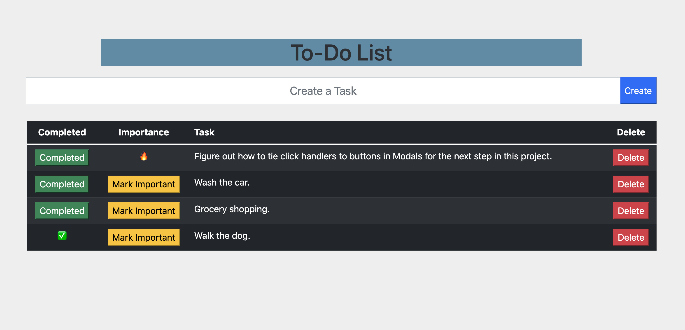

# Full Stack To-do List

## Description

Duration: 3 days.

A to do list that is stored in a database. Tasks that are created have options to be deleted, completed, or marked as important. 

Tasks are put in using the "Create a Task" input. When the "Create" button is pressed a POST call is sent to the server which sends a pool.query to the database to input a new task. The "importance" and "completed" columns are booleans that are initially left false and can be switched to true with their respective buttons. The tasks are sorted by which ones have been marked as important first.

The delete button will remove the task on the row it is tied to from the database. The button is tied to the row with the row's unique ID. A DELETE ajax call is sent to the server that sends a pool.query to the database to delete that task's row.

The completed button will put a green checkmark in the completed column. The completed button is tied to the current row with that row's unique ID in the database. A PUT call is sent to the server that sends a pool.query to the database switching the "completed" boolean from false to true. Rows are rendered based on their boolean status. When completed the button is then replaced with a checkmark.

The mark important button will put a fire emoji in the importance column and those tasks will be put at the top of the page. The mark important button sends a PUT request to the server that sends a pool.query to the database to change the "importance" boolean from false to true. Rows are rendered based on their boolean status. When marked important the button is then replaced with a fire emoji.

## Screen Shot

## Installation

## Usage

1. Type a task to create into the input field that says, "Create a task".
2. Click the blue "Create" button to save the task.
3. When the task is completed, click the green "Completed" button to check it off.
4. To organize multiple tasks, click the yellow "Mark Important" button to organize the most important tasks at the top of the page.
5. To delete tasks click the red "Delete" button to remove the task on that row.

## Built With

HTML, CSS, Javascript, jQuery, Bootstrap, Node.js, Express.js, Ajax, PostgreSQL

## Acknowledgement

Thank you to Prime Digital Academy for equipping me with the tools to create my first full stack application. 

## Support

If you have suggestions or issues, please email me at husomichael@gmail.com